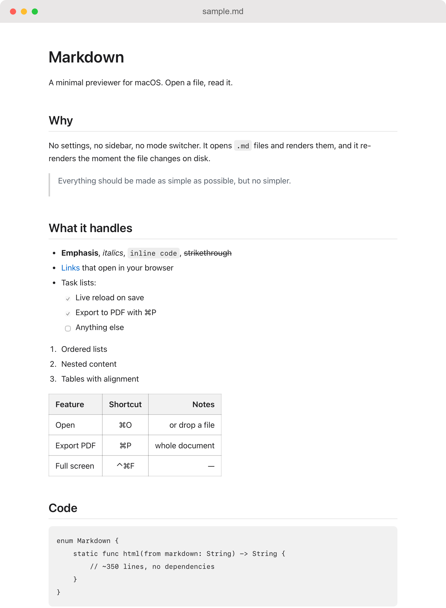
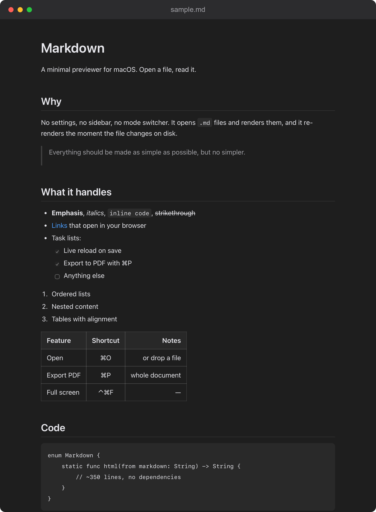

# Markdown

A minimal macOS Markdown previewer. Open a `.md` file, read it. No options.

<p align="center">
  
  
</p>

- `⌘O`, or drag a file onto the window, to open
- Re-renders automatically when the file changes on disk, preserving scroll position
- `⌘P` exports the whole document as a PDF
- Light and dark mode follow the system
- Links open in your browser; links to other `.md` files open in the preview

No dependencies: the Markdown parser is ~350 lines of Swift, and rendering is a
`WKWebView`. Supports headings, nested and ordered lists, task lists, tables with
alignment, fenced code blocks, blockquotes, rules, images, links, and the usual
inline emphasis. Raw HTML passes through, minus anything that would run code.
Local images are embedded as data URIs, since `WKWebView` will not load local
files for a page handed to it as a string.

## Build

```
./build.sh
```

Produces `Markdown.app` in this folder. Move it to `/Applications` if you like.

Requires Xcode, for `actool` to compile `Icon.icon` into an asset catalog —
macOS 26 renders a compiled icon natively, whereas a bare `.icns` is inset onto
a system-generated tile and looks wrong.

## Layout

| Path              | What it is                                          |
|:------------------|:----------------------------------------------------|
| `Sources/`        | The app: Markdown converter, stylesheet, AppKit shell |
| `Icon.icon/`      | Icon Composer source for the app icon                |
| `tools/snapshot/` | Renders a `.md` to PNG for the screenshots above     |
| `docs/`           | Screenshots and the sample document they render      |

The screenshots are generated from `docs/sample.md` through the app's own
converter and stylesheet, so they stay honest as the renderer changes:

```
swiftc -O Sources/Markdown.swift Sources/Style.swift Sources/Render.swift \
    tools/snapshot/main.swift -o /tmp/snapshot
/tmp/snapshot docs/sample.md out.png [dark] [width] [height]
```
